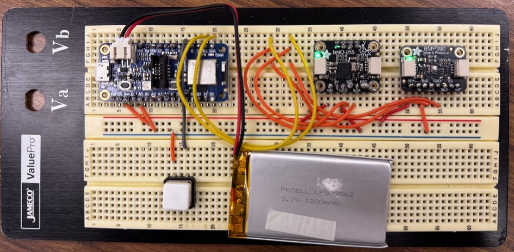
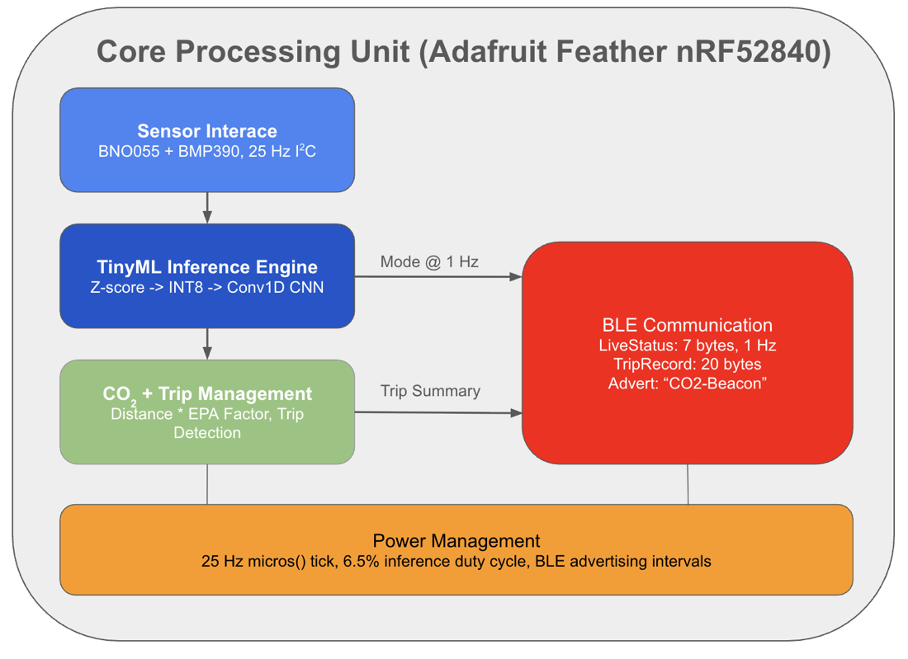
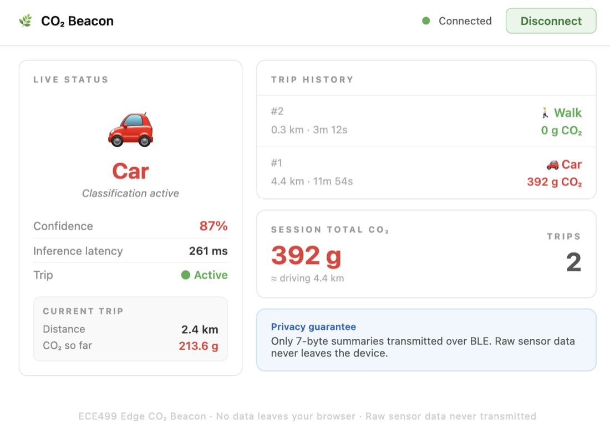
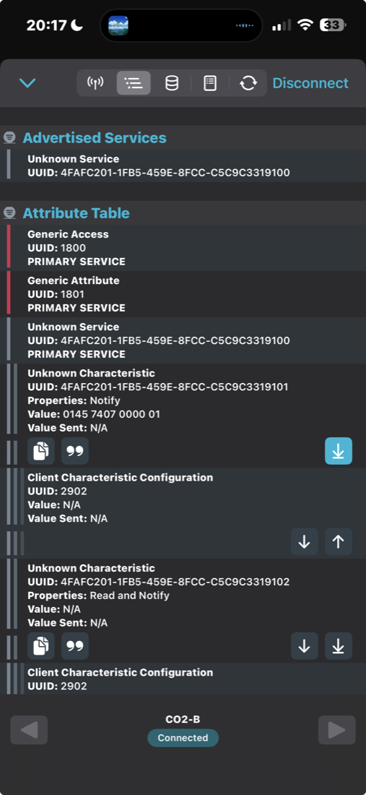
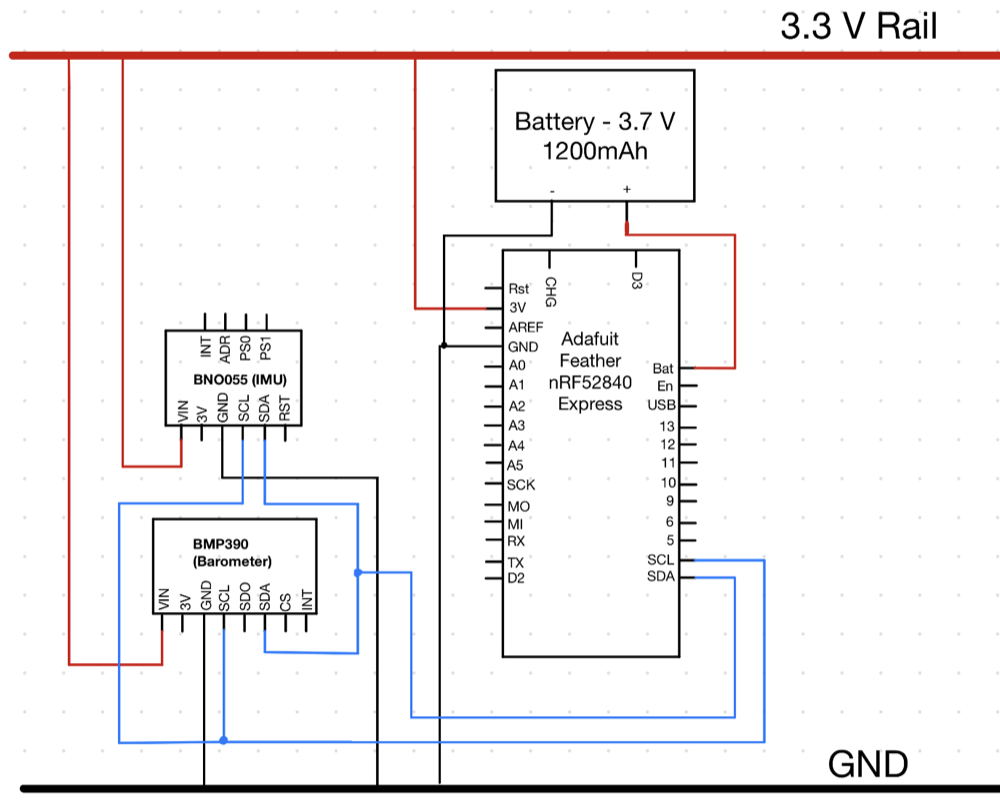
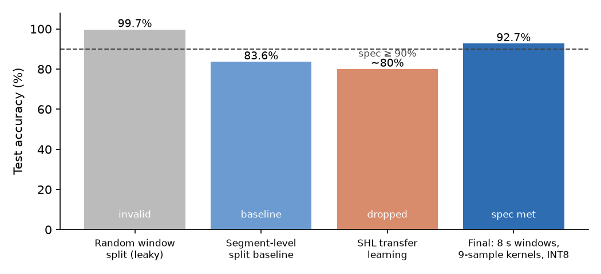
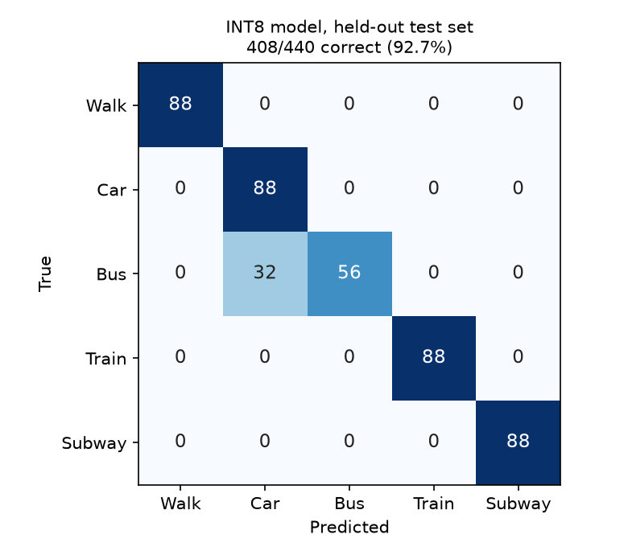

# Edge CO₂ Beacon

**On-device transportation-mode classification and per-trip CO₂ estimation on a Nordic nRF52840, with no GPS and no cloud.**

A battery-powered wearable samples an IMU and a barometer at 25 Hz, runs an INT8-quantized CNN with TensorFlow Lite Micro to classify walk, car, bus, train, or subway, and estimates each trip's CO₂. Only 7-byte status packets and 20-byte trip summaries leave the device over Bluetooth Low Energy, and a React dashboard reads them in the browser through Web Bluetooth.

Solo senior capstone, Union College ECE-498/499 (2025–26). Advisor: Prof. Michael Okwori.

<p align="center">
  
</p>

## Results

| Specification | Target | Result | Status |
|---|---|---|---|
| Classification accuracy (5 modes) | ≥ 90% | **92.7%** (408/440 held-out windows, INT8 model) | Met |
| Inference latency on the MCU | ≤ 1 s | **261.6 ms** (n = 30, σ = 0.7 ms) | Met |
| Model size | fit in 796 KB app flash | **361 KB** INT8 (from 1,423 KB float32) | Met |
| Battery runtime | ≥ 24 h on 1200 mAh | **48+ h** continuous sensing and inference | Met |
| Privacy | no raw data over BLE | only 2 characteristics: 7-byte LiveStatus, 20-byte TripRecord | Met by architecture |
| CO₂ estimation error | ≤ 20% per trip | **34.0%** mean over 5 car trips | **Not met** (see below) |

Full firmware build uses 62% of application flash and 28% of RAM. Inference runs every 4 s, so the MCU spends about 93.5% of its time in the sensor-polling loop.

## How it works

<p align="center">
  
</p>

**Sensing.** A BNO055 IMU and a BMP390 barometer share one I²C bus. The firmware schedules samples from `micros()` timestamps with wrap-safe comparisons, which holds 25 Hz without `delay()`. Seven channels (bias-corrected 3-axis acceleration, 3-axis gyro, pressure) go into a static ring buffer, with no dynamic allocation.

**Model.** Each inference sees an 8-second window (200 samples × 7 channels), z-score normalized with training-set statistics. The network is a small CNN written with `Conv2D(k, 1)` layers, so each kernel slides along time only. That choice kept every operator inside the TFLite Micro op set.

```
Input (200, 7, 1)
Conv2D 16 @ 9×1 → MaxPool 2×1
Conv2D 32 @ 9×1 → MaxPool 2×1
Flatten → Dense 32 → Dropout 0.3 → Dense 5 (softmax)
```

The Flatten → Dense layer dominated the model's size. Cutting it from 64 to 32 units brought the INT8 model from 729 KB to 361 KB, which is what made it fit next to the SoftDevice, TFLite runtime, and sensor drivers. The TFLite Micro arena is 50 KB, with about 30 KB used at peak.

**CO₂ and trips.** Every 4 s, the current mode adds a distance slice (mode's average speed × 4 s) and a CO₂ slice (distance × EPA emission factor). A state machine detects trip boundaries and emits one TripRecord per trip.

**BLE.** A custom 128-bit GATT service exposes a LiveStatus notification at 1 Hz (mode, confidence, running CO₂, flags) and a TripRecord (mode, duration, distance, CO₂). Both payloads are little-endian packed structs, verified byte by byte in nRF Connect.

<p align="center">
  
  &nbsp;
  
</p>

<details>
<summary>Wiring schematic</summary>
<p align="center"></p>
</details>

## What the data taught me

<p align="center">
  
</p>

**The first result was wrong.** My first model scored 99.7%. Windows overlapped by 50%, and a random split put near-duplicate windows on both sides of the train/test boundary. Splitting by recording segment removed the leak and gave the honest baseline of 83.6%.

**Transfer learning did not help.** I pretrained on the public SHL dataset (phones carried in a bag) and fine-tuned on my own data. It stalled near 80%, below training from scratch, because a phone in a bag and a breadboard in a backpack see motion from different orientations.

**Longer context fixed most of the rest.** Moving to 8-second windows and 9-sample kernels (up from 5), trained on my own data only, reached 92.7% on a balanced test set of 88 windows per class. Four of five modes are perfect. The remaining error is one-directional: 32 bus windows read as car, because a bus on an open road without stops moves like a car, while a car never shows a bus's stop-and-go pattern. In this application that confusion is cheap, since the EPA factor used for both modes is 0.089 kg CO₂/km.

<p align="center">
  
</p>

The test set was evaluated with the INT8 model through the TFLite interpreter, so the number reflects the same quantized arithmetic that runs on the board.

## Known limitations

**CO₂ estimation missed its target.** Over five car trips, estimated CO₂ was off by 34.0% on average against Google Maps distance × EPA factor (range 13.4%–57.6%, 1 of 5 within spec). The classifier was not the problem. The firmware assumes car travel always averages 40 km/h, and real trips did not. Periodic GPS fixes (about one per 30 s) would replace the speed assumption, and the measured power budget has room for it.

**The model did not survive a change of place.** All training data was collected by one person near sea level in New York. When I deployed the firmware in Golden, Colorado (about 1,700 m), pressure readings arrived at a z-score of about −28, and the model called every window subway or bus. Retraining without the pressure channel removed that failure, but car accuracy then fell to 23.7% on different roads and a different vehicle. The lesson is that a single-user dataset has to be collected where the device will be used. That 6-channel retrain lives on the [`golden-6ch-retrain`](../../tree/golden-6ch-retrain) branch.

Other gaps: the firmware is a cooperative superloop with no RTOS or sleep modes, battery life was measured as runtime to shutdown without a current meter, and results come from single training runs with no repeated seeds.

## Repository layout

| Path | Contents |
|---|---|
| `firmware/beacon_inference/` | Production firmware: sampling, preprocessing, TFLite Micro inference, CO₂ and trip logic, BLE service |
| `firmware/LOGGER_BUTTON_v1.3/` | Data-collection firmware with button-labelled segments |
| `logging/serial_logger_v1.3.py` | Serial capture: per-segment files, banner parsing, mode-mismatch checks |
| `notebooks/` | Windowing, segment-level splits, QA scans, FFT and feature exploration, SHL experiments, TFLite conversion |
| `notebooks/colab/` | Model training notebooks, baseline through v4 |
| `model/co2_beacon_int8.tflite` | Deployed INT8 model (361 KB) |
| `data/raw/self_collected/` | 21 labelled recordings across 5 modes, about 3.9 hours at 25 Hz |
| `dashboard/index.html` | Single-file React 18 dashboard using Web Bluetooth |
| `docs/` | Architecture, BLE payload layout, debugging guide, and the 16 GitHub issues with acceptance criteria that the build followed |
| `reports/` | Test plan and project poster |

## Build and run

**Firmware.** Arduino IDE with the Adafruit nRF52 board package, plus the Adafruit BNO055 and Adafruit BMP3XX libraries and a TensorFlow Lite Micro Arduino library (`TensorFlowLite.h`). Open `firmware/beacon_inference/beacon_inference.ino`, select *Adafruit Feather nRF52840 Express*, and upload. Serial output at 115200 baud prints mode, confidence, and per-inference latency.

**Dashboard.** Web Bluetooth needs a secure context, so serve the folder locally and open it in Chrome:

```bash
cd dashboard && python3 -m http.server 8000
```

Then open `http://localhost:8000`, click Connect, and choose `CO2-Beacon`.

**Model.** Training runs in the Colab notebooks under `notebooks/colab/`. `notebooks/scripts/convert_to_tflite.py` performs INT8 post-training quantization with a representative dataset, and `export_norm_stats.py` writes the matching `norm_stats.h` for the firmware.

## Development notes

The build was run from 16 scoped GitHub issues (`docs/BUILD_PHASES.md`), and commits reference them by number. I wrote the requirements, collected and labelled the data, designed the experiments, and made the design calls. Much of the implementation was done with an AI coding assistant working from the structured instructions in `docs/CLAUDE.md`, and I reviewed and hardware-tested each change.

## Author

**Spencer Aldrich** · M.S. ECE (AI), Boston University · [LinkedIn](https://www.linkedin.com/in/spencer-aldrich-eng)
